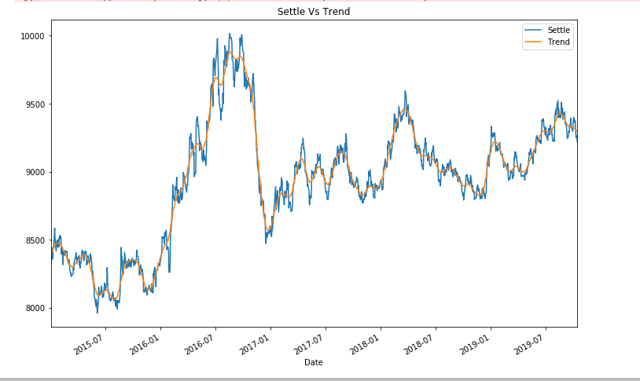
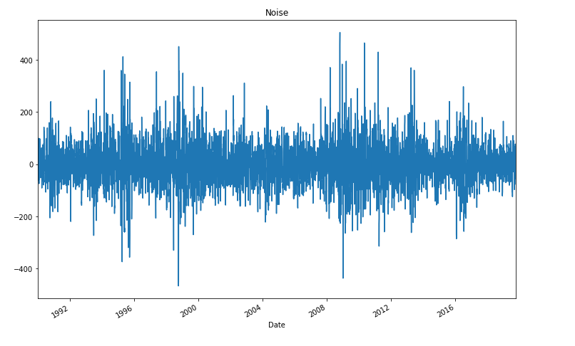
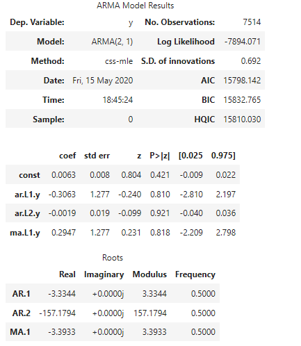
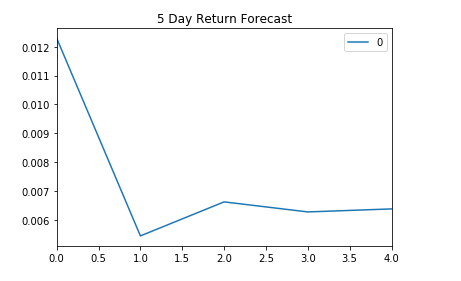
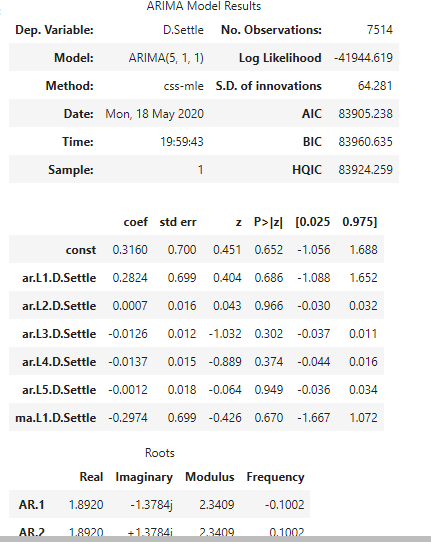
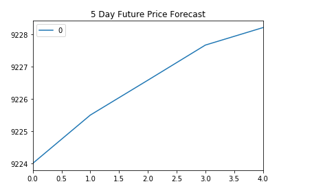
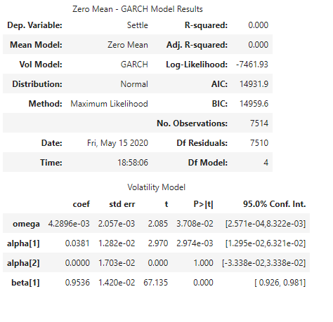
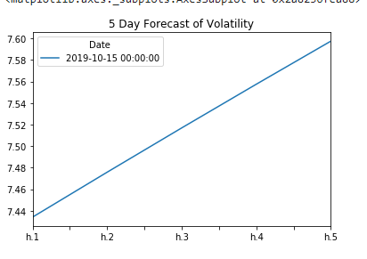
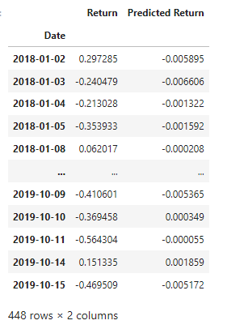
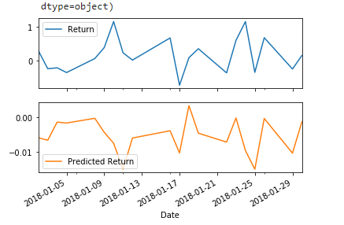

# Unit 10—A Yen for the Future


## Background

The financial departments of large companies often deal with foreign currency transactions while doing international business. As a result, they are always looking for anything that can help them better understand the future direction and risk of various currencies. Hedge funds, too, are keenly interested in anything that will give them a consistent edge in predicting currency movements.

In this assignment, we tested many time-series tools in order to predict future movements in the value of the Japanese yen versus the U.S. dollar.

Following tasks:

1. Time Series Forecasting
2. Linear Regression Modeling

- - -

### Files

[Time-Series Starter Notebook](Starter_Code/time_series_analysis.ipynb)

[Linear Regression Starter Notebook](Starter_Code/regression_analysis.ipynb)

[Yen Data CSV File](Starter_Code/yen.csv)

- - -

#### Time-Series Forecasting

Determining whether there are any predictable behavior based on the historical Dollar-Yen Exchange rate futures data and applying time series analysis and modeling

Following tasks were performed:

1. Decomposition using a Hodrick-Prescott Filter (Decompose the Settle price into trend and noise).

   

   

2. Forecasting Returns using an ARMA Model.

    

    

3. Forecasting the Settle Price using an ARIMA Model.

    

    
    
    
4. Forecasting Volatility with GARCH.

    

    

Use the results of the time series analysis and modeling to answer the following questions:

1. Based on your time series analysis, the Yen prices are increasing for the short term. 
2. The risk is expected to increase for the Yen 
3. For ARMA & ARIMA models, p < 0.05 and also, AIC & BIC values are way high. These are not the best models for trading.


#### Linear Regression Forecasting

Built a Scikit-Learn linear regression model to predict Yen futures ("settle") returns with *lagged* Yen futures returns and categorical calendar seasonal effects (e.g., day-of-week or week-of-year seasonal effects).

Following tasks performed:

1. Data Preparation (Creating Returns and Lagged Returns and splitting the data into training and testing data)
2. Fitting a Linear Regression Model.
3. Making predictions using the testing data.

```
predictions = model.predict(X_test)
```





    

4. Out-of-sample performance.

```
Out-of-sample Root Mean Squared Error (RMSE): 0.41521640820129047
```

5. In-sample performance.

```
In-sample Root Mean Squared Error (RMSE): 0.5663352320297497
```

Use the results of the linear regression analysis and modeling to answer the following question:

* Does this model perform better or worse on out-of-sample data compared to in-sample data?

```
RMSE for Out-of-sample is lower (0.415) as compared to in-sample (0.566). Model performs better on out-of-sample data 
```

- - -

